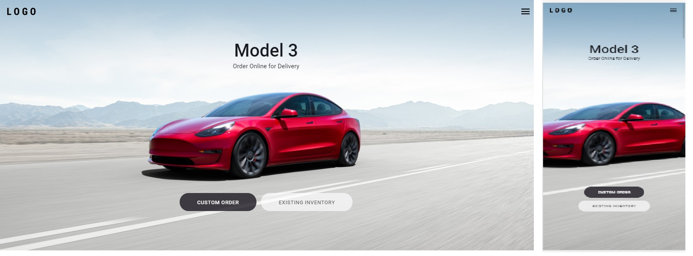
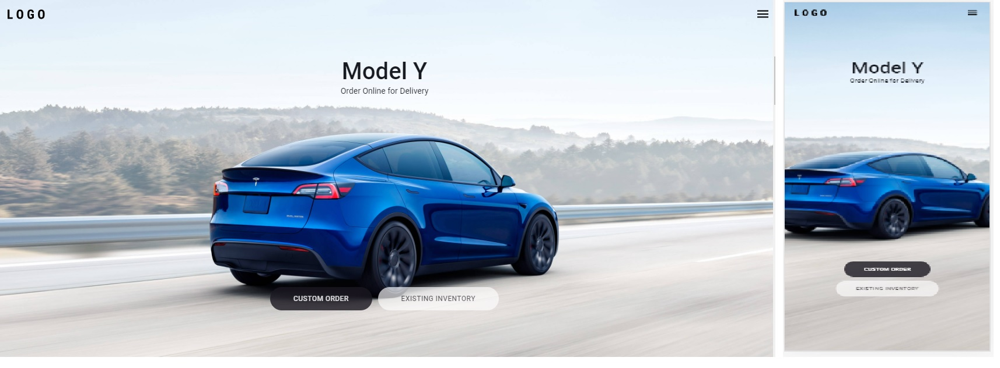
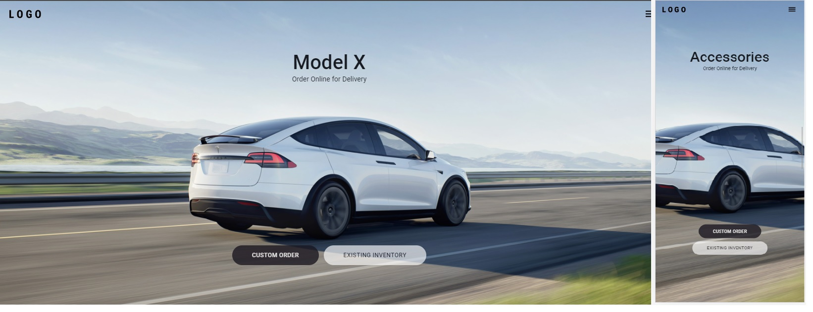

# Clone UI tesla 💛🚀

<p align="center">Feito com 💙 por Hugo Alves Varella</p>

&nbsp;


<div>
  
  
  
</div>

## 📚 Informações sobre o projeto

- Esse projeto foi desenvolvido durante uma aula no youtube da Rocketseat, aonde o intuito era desenvolver um clone ta interface do site da tesla com os efeito de transições e Mobile First.

&nbsp;

## 💻 O que tem no projeto?

- Mobile First.
- responsividade.
- Animações com Framer-Motion.

&nbsp;

## 🛠️ Tecnologias/Ferramentas ultilizadas

- [React](https://pt-br.reactjs.org/E)
- [styled-components](https://styled-components.com/)
- [framer-motion](https://www.framer.com/motion/)


&nbsp;

## ⚙️ Instalação

```
# Abra um terminal e copie este repositório com o comando
$ git clone https://github.com/Hugovarellaa/clone-homepage-tesla
```

```
# Acesse a pasta da aplicação
$ cd clone-homepage-tesla

# Instale as dependências
$ yarn

# Inicie a aplicação
$ yarn start

```
